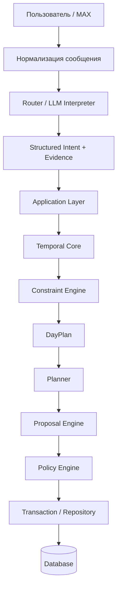

# ИИ-Ассистент / AI-Assistant

**Персональный ИИ-ассистент с памятью, планированием и безопасным выполнением действий.**

ИИ-Ассистент — развиваемая платформа персонального цифрового помощника. Календарь, задачи и планирование — первая крупная функциональная область проекта, но архитектура рассчитана на дальнейшее расширение ассистента за её пределы.

> **Главный принцип:** LLM понимает естественный язык и формирует структурированное намерение; детерминированный код проверяет данные, выполняет вычисления, применяет ограничения и контролирует изменения состояния.

[English version](README_EN.md)

## Возможности

- понимание команд и сообщений на естественном языке;
- задачи, события, сроки и повторяющиеся действия;
- работа с прямыми и пересланными сообщениями;
- структурированная память о фактах, людях и контексте;
- календарное планирование и поиск конфликтов;
- учёт времени на дорогу и внешних условий;
- формирование проверяемого плана дня;
- предложения изменений с подтверждением там, где это необходимо;
- сохранение источника (evidence/provenance) значимых данных;
- напоминания;
- архитектурная основа для обучения на пользовательских предпочтениях;
- возможность дальнейшего расширения новыми навыками и сервисами.

## Архитектурная идея

LLM намеренно отделена от критических вычислений и записи данных. Ошибка модели не должна непосредственно изменять пользовательское состояние.

## Ключевые инженерные решения

### Детерминированное временное ядро
Даты, время, интервалы, повторения и относительные временные выражения обрабатываются кодом, а не свободным рассуждением LLM.

### Движок ограничений
Пересечения, конфликты и допустимость временных интервалов проверяются детерминированно, что делает поведение воспроизводимым и тестируемым.

### DayPlan
Производное представление дня объединяет события, запланированные задачи, ограничения, конфликты, неопределённости и свободные окна, не становясь отдельным источником истины.

### Evidence / Provenance
Для значимых данных архитектура сохраняет связь с исходным сообщением пользователя. Это позволяет объяснить, откуда появилась информация и почему было предложено или выполнено действие.

### Proposal + Policy
Изменения сначала представляются как предложения. Политика определяет, можно ли выполнить действие автоматически, требуется ли подтверждение, уточнение или отказ.

### Персональные предпочтения
Архитектура предусматривает обучение на повторяющихся решениях пользователя. Предпочтения могут ранжировать только допустимые варианты и не отменяют явные указания или жёсткие ограничения.

## Технологии

Python · SQLite · LLM API · structured output · MAX · внешние сервисы геокодирования, маршрутизации, мест и погоды · unit/integration/contract/regression tests.

## Статус

Проект находится в активной разработке и поэтапной архитектурной миграции. Новые слои вводятся с тестированием и контролем совместимости, без одномоментного переписывания работающей системы.

## О репозитории

Это публичная портфолио-версия проекта. Production-код, пользовательские данные, секреты, конфигурация сервера и эксплуатационные журналы здесь не публикуются.

## Документация

- [Обзор проекта](docs/PROJECT_OVERVIEW_RU.md)
- [Project overview — English](docs/PROJECT_OVERVIEW_EN.md)
- [Архитектура](docs/ARCHITECTURE_RU.md)
- [Architecture — English](docs/ARCHITECTURE_EN.md)
