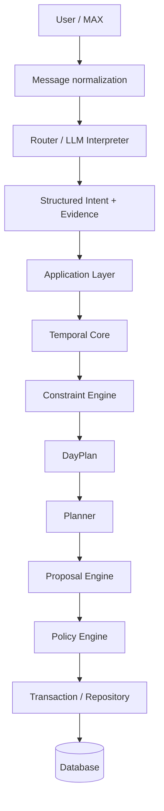

# AI-Assistant / ИИ-Ассистент

**A personal AI assistant with memory, planning and controlled action execution.**

AI-Assistant is an evolving personal digital assistant platform. Calendar, tasks and planning are its first major functional domain, while the architecture is intended to support capabilities well beyond scheduling.

> **Core principle:** the LLM understands natural language and produces structured intent; deterministic code validates data, performs calculations, applies constraints and controls state changes.

[Русская версия](README.md)

## Capabilities

- natural-language commands and messages;
- tasks, events, deadlines and recurring activities;
- direct and forwarded message processing;
- structured memory about facts, people and context;
- calendar planning and conflict detection;
- travel-time and external-service constraints;
- deterministic day-plan construction;
- proposed changes with confirmation when required;
- evidence/provenance for important structured data;
- reminders;
- an architectural foundation for learning user planning preferences;
- extension with additional assistant skills and services.

## Architecture

The LLM is deliberately separated from critical calculations and persistence. A model error should not directly modify user state.

## Key engineering ideas

### Deterministic temporal core
Dates, times, intervals, recurrence and relative temporal expressions are handled by code rather than trusted to free-form LLM reasoning.

### Constraint engine
Overlaps, conflicts and interval feasibility are checked deterministically, making planning reproducible and testable.

### DayPlan
A derived day representation combines events, scheduled tasks, constraints, conflicts, uncertainties and free windows without becoming a second source of truth.

### Evidence / Provenance
Important structured data can retain a link to the source user message, allowing the system to explain where information came from and why an action was proposed or executed.

### Proposal + Policy
Potential changes are represented as proposals. Policy determines whether an action can be executed automatically, requires confirmation or clarification, or must be rejected.

### Personal preferences
The architecture is designed to learn from repeated user choices. Preferences can rank only feasible options and cannot override explicit instructions or hard constraints.

## Technology

Python · SQLite · LLM APIs · structured output · MAX · external geocoding, routing, places and weather services · unit/integration/contract/regression tests.

## Status

The project is under active development and incremental architectural migration. New layers are introduced with testing and compatibility controls rather than through a one-shot rewrite of the working system.

## Repository note

This is a public portfolio version of the project. Production source code, user data, secrets, server configuration and operational logs are not published here.

## Documentation

- [Project overview](docs/PROJECT_OVERVIEW_EN.md)
- [Обзор проекта — русский](docs/PROJECT_OVERVIEW_RU.md)
- [Architecture](docs/ARCHITECTURE_EN.md)
- [Архитектура — русский](docs/ARCHITECTURE_RU.md)
