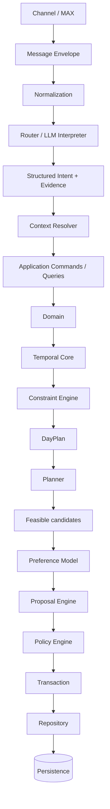

# AI-Assistant — Architecture

## Core principle

The architecture separates probabilistic language understanding from deterministic execution. The LLM produces structured intent and evidence but should not directly mutate user state.

## Target flow

## Responsibilities

**LLM Interpreter** — understands natural language and returns a validated structure.

**Temporal Core** — resolves dates, times, intervals and recurrence.

**Constraint Engine** — determines conflicts and constraints.

**DayPlan** — assembles a verified derived representation of a day.

**Planner** — searches for feasible changes and candidate plans without directly persisting them.

**Preference Model** — ranks only already-feasible candidates based on observed user behavior.

**Proposal Engine** — represents a potential change as an explicit object.

**Policy Engine** — determines the execution mode: automatic action, confirmation, clarification or rejection.

**Repository / Transaction boundary** — the controlled boundary for persistent state changes.

## Evidence and explainability

For important data, the system is intended to reconstruct its source: message, source type and supporting quote. An LLM assumption must not silently become a user fact.

## Architectural safety

The LLM has no direct SQL access and should not independently calculate critical temporal values. Mutations pass through validation, domain rules, constraints and policy. Re-delivery of the same message should not cause duplicate mutations.

## Extensibility

Planning is one domain of AI-Assistant. The general Interpreter → Application → Domain → Policy → Persistence boundary is intended to support additional assistant capabilities while preserving controlled execution.
