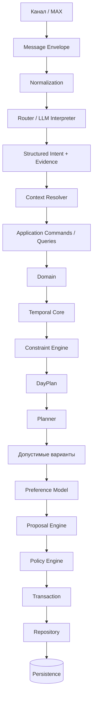

# ИИ-Ассистент — архитектура

## Основной принцип

Архитектура строится вокруг разделения вероятностного понимания языка и детерминированного исполнения. LLM формирует структурированное намерение и evidence, но не должна напрямую изменять состояние пользователя.

## Целевой поток

## Границы ответственности

**LLM Interpreter** — понимает естественный язык и возвращает валидируемую структуру.

**Temporal Core** — вычисляет даты, время, интервалы и повторения.

**Constraint Engine** — определяет конфликты и ограничения.

**DayPlan** — собирает проверенное производное состояние дня.

**Planner** — ищет допустимые изменения и кандидатные планы, но не записывает их самостоятельно.

**Preference Model** — ранжирует только уже допустимые варианты на основании наблюдаемого поведения пользователя.

**Proposal Engine** — представляет потенциальное изменение как отдельный объект.

**Policy Engine** — определяет режим исполнения: автоматическое действие, подтверждение, уточнение или отказ.

**Repository / Transaction boundary** — единственная контролируемая граница изменения постоянного состояния.

## Evidence и объяснимость

Для значимых данных система должна уметь восстановить источник: сообщение, тип источника и подтверждающую цитату. Предположение LLM не должно незаметно превращаться в пользовательский факт.

## Безопасность архитектуры

LLM не получает прямого доступа к SQL и не должна самостоятельно рассчитывать критические временные значения. Записывающие операции проходят валидацию, доменные правила, ограничения и policy. Повторная доставка одного сообщения не должна создавать повторные изменения.

## Расширяемость

Планировочная подсистема — один из доменов ИИ-Ассистента. Общая граница Interpreter → Application → Domain → Policy → Persistence позволяет в дальнейшем подключать другие функции ассистента, сохраняя принцип контролируемого исполнения.
